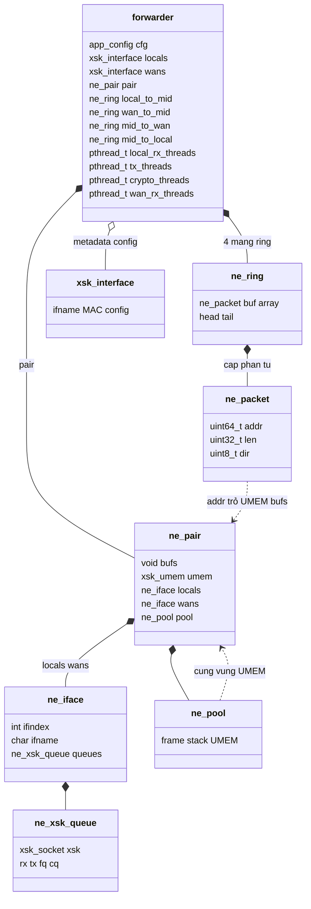
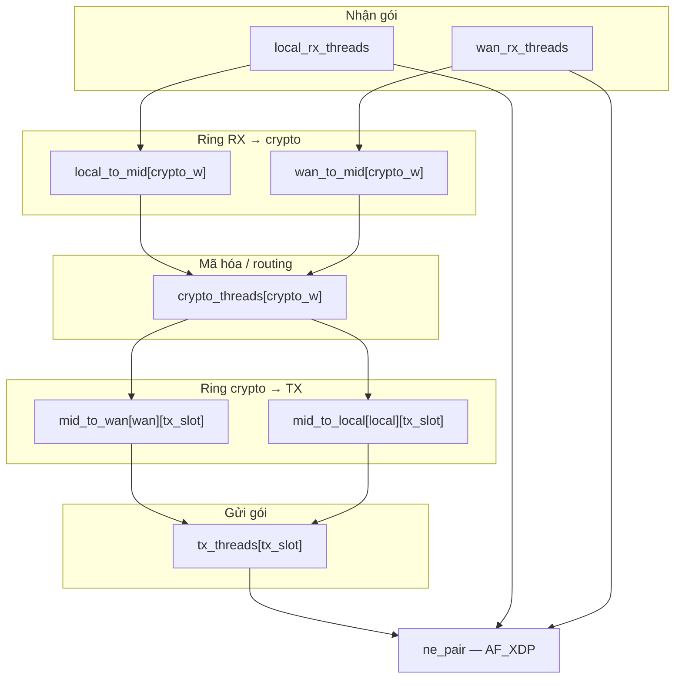
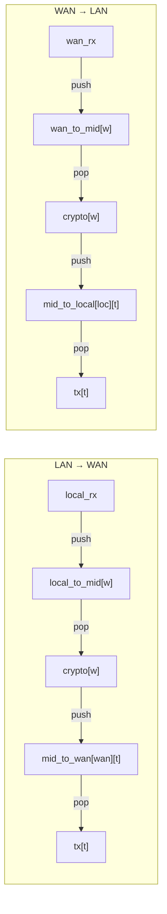
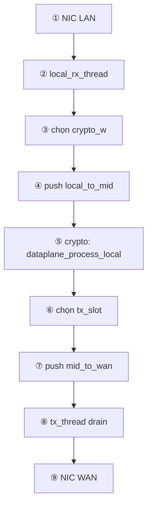
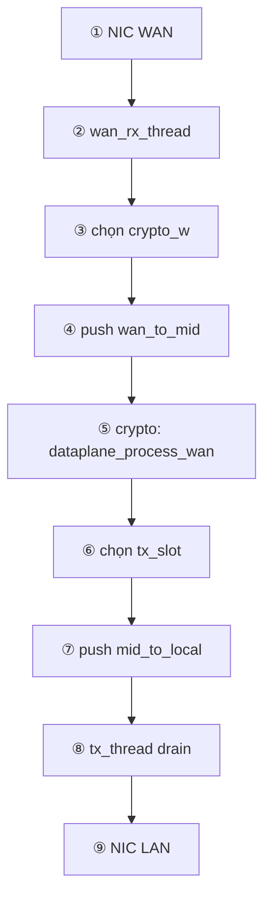
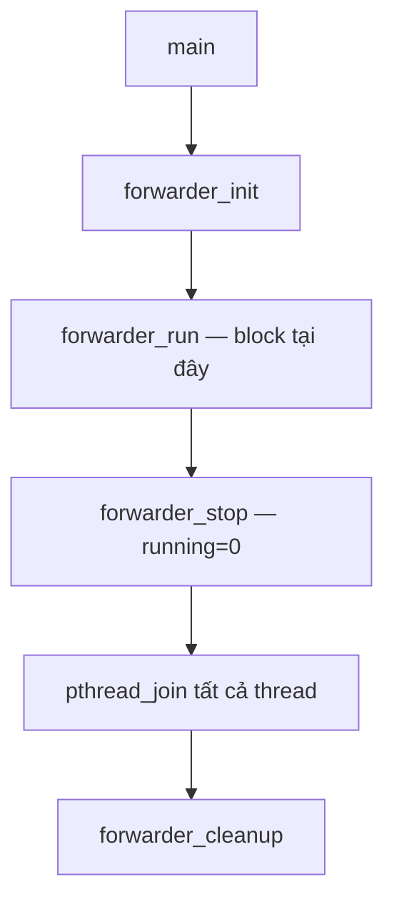
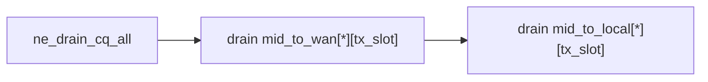
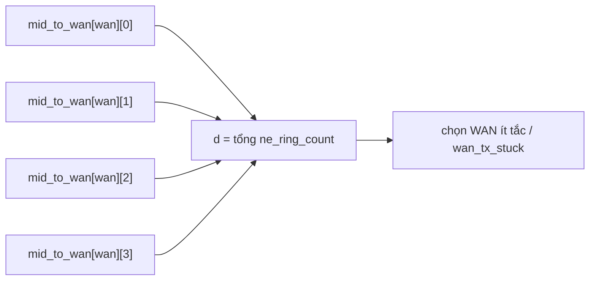

# forwarder — kiến trúc dataplane

> **Mục đích:** file này **không** thay `forwarder.h`. Header liệt kê field; doc này trả lời **ai nối với ai**, **gói đi đường nào**, **index ring thế nào**.  
> Chi tiết field: [`inc/core/forwarder.h`](../inc/core/forwarder.h) · AF_XDP: [`interface.md`](interface.md)

<style>
.t{color:#4ec9b0}.p{color:#c586c0}.v{color:#e0e0e0}.m{color:#4fc1ff}.fn{color:#dcdcaa}
</style>

---

## 1. Sơ đồ quan hệ struct (toàn bộ)



**Đọc sơ đồ:**

| Mũi tên | Nghĩa |
|---------|--------|
| `*--` | struct **chứa** struct/array bên trong (sở hữu) |
| `o--` | tham chiếu metadata, **không** dùng I/O |
| `..>` | con trỏ / offset trỏ sang vùng khác |

- <span class="t">forwarder</span>.<span class="v">pair</span> → toàn bộ AF_XDP (UMEM, NIC)  
- <span class="t">forwarder</span>.<span class="v">local_to_mid</span>… → ring mềm giữa thread (phần tử là <span class="t">ne_packet</span>)  
- <span class="t">forwarder</span>.<span class="v">locals</span>/<span class="v">wans</span> (<span class="t">xsk_interface</span>) → tên/MAC config, I/O đi qua <span class="v">pair</span>

Chi tiết <span class="t">ne_pair</span> → <span class="t">ne_iface</span> → <span class="t">ne_xsk_queue</span>: [`interface.md` §1](interface.md#1-phân-cấp-struct-interfaceh)

---

## 2. Bức tranh luồng thread (runtime)



**12 thread baseline:** 1 RX LAN + 1 RX WAN + 4 TX + 6 crypto. CPU map: [`cpu_map.h`](../inc/core/cpu_map.h).

---

## 3. `struct forwarder` — field dataplane trong sơ đồ trên

Không liệt kê lại header — xem [`forwarder.h`](../inc/core/forwarder.h).  
Trong sơ đồ §1, các field ring/thread là **mảng** (kích thước `NE_CRYPTO_WORKERS`, `NE_TX_SLOTS`, …).

Ví dụ tách <span class="t">kiểu</span> / <span class="v">tên</span>:

<div style="font-family:monospace;font-size:0.95em;line-height:1.8">

<span class="t">ne_ring</span> <span class="v">mid_to_wan</span><span style="color:#888">[MAX_INTERFACES][NE_TX_SLOTS]</span><br>
<span class="t">ne_ring</span> <span class="v">local_to_mid</span><span style="color:#888">[NE_CRYPTO_WORKERS]</span><br>
<span class="t">pthread_t</span> <span class="v">tx_threads</span><span style="color:#888">[NE_TX_SLOTS]</span>

</div>

---

## 4. Ring — ai push, ai pop



| Ký hiệu | Nghĩa |
|---------|--------|
| `w` / `crypto_w` | crypto worker 0…5 (code RX: `wi`, crypto: `worker_idx`) |
| `t` / `tx_slot` | TX thread 0…3 (`dp_pick_tx_slot`) |
| `wan`, `loc` | chỉ số card dataplane |

**Quan trọng:** `mid_to_wan` index theo **`tx_slot`**, không theo crypto worker.

---

## 5. LAN → WAN — 9 bước



| Bước | Hàm chính |
|:--:|-----------|
| ② | `ne_recv_local_slot` |
| ③ | `dp_crypto_pick_local_worker` |
| ⑤ | `dataplane_process_local` |
| ⑥ | `dp_pick_tx_slot` |
| ⑧ | `ne_tx_drain_wan_all` |

---

## 6. WAN → LAN — 9 bước



Khác LAN→WAN ở ring: `wan_to_mid` + `mid_to_local` + `ne_tx_drain_local_all`.

---

## 7. Vòng đời chương trình

**Không** phải đường gói tin — là thứ tự khi chạy binary:



| Giai đoạn | Làm gì |
|-----------|--------|
| `init` | Mở `ne_pair`, `ne_ring_init`, **chưa** có thread RX/TX |
| `run` | Tạo thread: RX LAN → TX×4 → crypto×6 → RX WAN |
| `cleanup` | `ne_ring_destroy`, `ne_pair_close` |

---

## 8. tx_thread — mỗi vòng lặp



Một `tx_threads[t]` lo **cả** WAN và LAN; chỉ drain ring có cùng `t`.

---

## 9. fwd_mid_to_wan_depth — đếm gói kẹt WAN



- <span class="fn">ne_ring_count</span>(ring) = số gói đang chờ trong **một** ring  
- <span class="fn">fwd_mid_to_wan_depth</span> = cộng 4 ring `mid_to_wan[wan_dp][0..3]`

---

## 10. Ma trận ring (baseline)

```
              crypto_w:   0    1    2    3    4    5
local_to_mid           [R]  [R]  [R]  [R]  [R]  [R]
wan_to_mid             [R]  [R]  [R]  [R]  [R]  [R]

mid_to_wan[wan0]  tx:  [0]  [1]  [2]  [3]
mid_to_local[loc0] tx: [0]  [1]  [2]  [3]
```

---

## 11. Khi debug

| Triệu chứng | Hỏi |
|-------------|-----|
| Không ra WAN | Crypto push `mid_to_wan[wan][t]` — TX drain cùng `t`? |
| Scale TX hỏng | `tx_threads[i]` có drain `mid_to_wan[*][i]`? |
| RX chết | Số RX slot > số hardware queue? |

Màu trong doc: <span class="t">kiểu</span> · <span class="v">biến/field</span> · <span class="fn">hàm</span>
