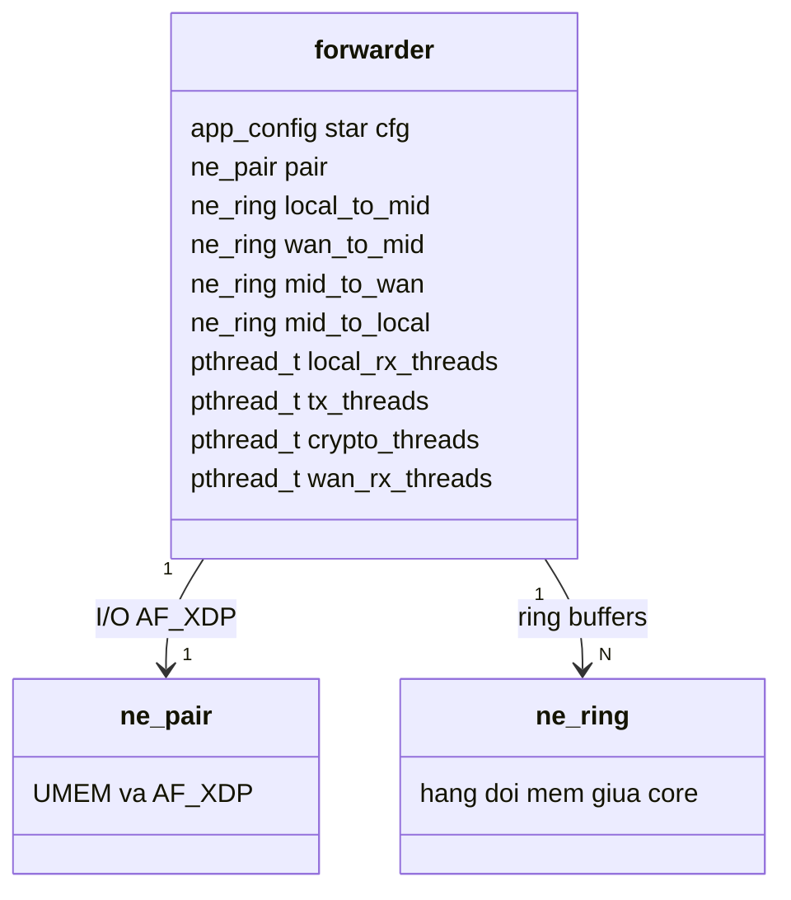
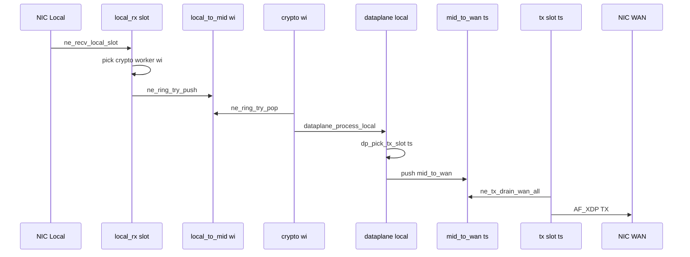
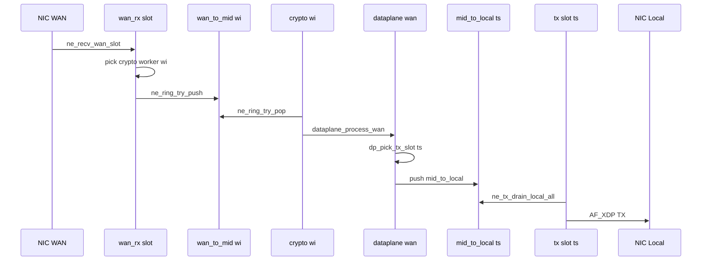
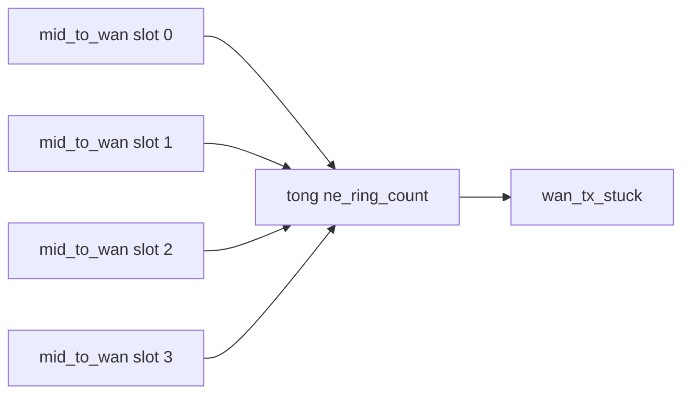
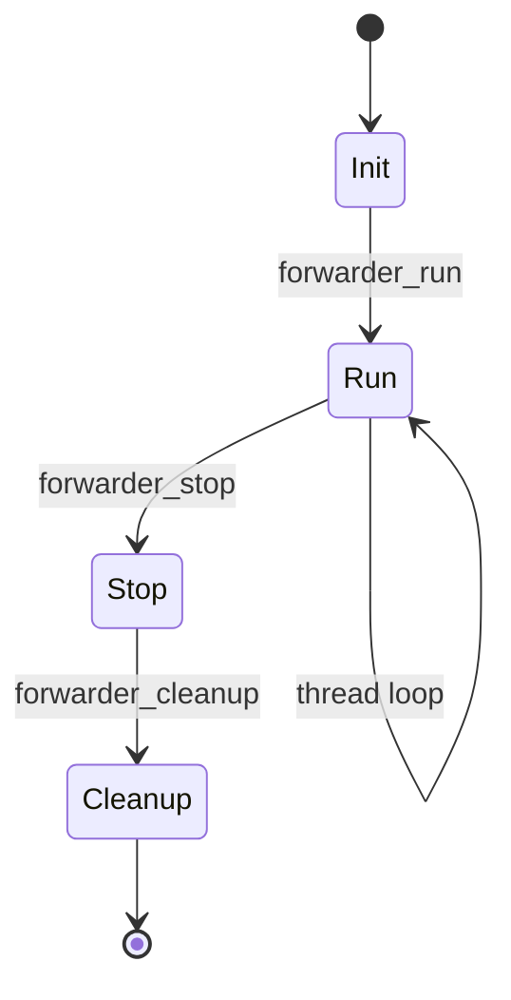

# `forwarder.h` — điều phối luồng & ring giữa các core

> **Đọc file:** mở preview Markdown (`Ctrl+Shift+V`) — cần extension [Markdown Preview Mermaid Support](https://marketplace.visualstudio.com/items?itemName=bierner.markdown-mermaid) (hoặc Mermaid built-in VS Code 1.121+).  
> File nguồn: [`inc/core/forwarder.h`](../inc/core/forwarder.h) · [`src/core/forwarder.c`](../src/core/forwarder.c)  
> Liên quan: [`interface.md`](interface.md)

`struct forwarder` là **trung tâm dataplane**: nối `ne_pair` (driver) với `ne_ring` (hàng đợi mềm) và các `pthread` pin CPU theo [`cpu_map.h`](../inc/core/cpu_map.h).

---

## Tổng quan một dòng

```
RX LAN/WAN  ──►  local_to_mid[wi] / wan_to_mid[wi]  ──►  crypto worker wi
                                                              │
                                                              ▼
                                                    dataplane_process_*
                                                              │
                         mid_to_wan[iface][tx_slot]  ◄────────┘ (egress WAN)
                         mid_to_local[iface][tx_slot] ◄────────┘ (egress LAN)
                                                              │
                                                              ▼
                                                    tx_threads[tx_slot]
                                                    (drain CQ + TX cả LAN & WAN)
```

---

## 1. `struct forwarder` — các thành phần



Chi tiết field đầy đủ trong `forwarder.h`:

| Nhóm | Field | Ghi chú |
|------|-------|---------|
| Config | `cfg`, `locals[]`, `wans[]`, `wan_cfg_idx[]` | metadata card; I/O qua `pair` |
| Driver | `pair` | `ne_pair` — xem interface.md |
| Ring RX→crypto | `local_to_mid[NE_CRYPTO_WORKERS]` | RX LAN push, crypto pop |
| Ring RX→crypto | `wan_to_mid[NE_CRYPTO_WORKERS]` | RX WAN push, crypto pop |
| Ring crypto→TX | `mid_to_wan[i][t]`, `mid_to_local[i][t]` | `i` = iface slot, `t` = TX slot |
| Thread | `local_rx_threads`, `wan_rx_threads`, `tx_threads`, `crypto_threads` | pin CPU từ `cpu_map` |
| WAN health | `wan_tx_stuck`, `wan_tx_cooldown` | phát hiện egress kẹt |

### Bảng ring — chỉ số quan trọng

| Mảng | Kích thước | Ai push | Ai pop |
|------|------------|---------|--------|
| `local_to_mid[w]` | `w` = 0 .. NE_CRYPTO_WORKERS-1 | `local_rx_thread` | `crypto_threads[w]` |
| `wan_to_mid[w]` | giống trên | `wan_rx_thread` | `crypto_threads[w]` |
| `mid_to_wan[i][t]` | `i` = WAN slot, `t` = TX slot | crypto qua `dp_pick_tx_slot` | `tx_threads[t]` |
| `mid_to_local[i][t]` | `i` = local slot, `t` = TX slot | crypto | `tx_threads[t]` |

> **Lưu ý:** `mid_to_wan` / `mid_to_local` index theo **TX slot**, không theo crypto worker.

---

## 2. Cụm CPU & thread (baseline `cpu_map.h`)

| Cụm | Macro | Số luồng | Mảng CPU | Hàm thread |
|-----|-------|----------|----------|------------|
| RX LAN | `NE_CLUSTER_RX_LAN` | 1 | `ne_cpu_rx_lan` | `local_rx_thread` |
| RX WAN | `NE_CLUSTER_RX_WAN` | 1 | `ne_cpu_rx_wan` | `wan_rx_thread` |
| TX | `NE_CLUSTER_TX` | 4 | `ne_cpu_tx` | `tx_thread` |
| Crypto | `NE_CLUSTER_CRYPTO` | 6 | `ne_cpu_crypto` | `crypto_worker_thread` |

Baseline core (sửa trong `cpu_map.c`):

```
RX LAN: 0        RX WAN: 11
TX:     1, 2, 9, 10
Crypto: 3, 4, 5, 6, 7, 8
```

---

## 3. Luồng dữ liệu Local → WAN



---

## 4. Luồng dữ liệu WAN → Local



---

## 5. Thread TX — một luồng, cả LAN lẫn WAN

`tx_thread` **không** tách `local_tx` / `wan_tx`. Mỗi `tx_slot` làm:

1. `ne_drain_cq_all(pair, tx_slot)` — trả frame TX xong về pool
2. Với mọi WAN live: drain `mid_to_wan[wan][tx_slot]`
3. Với mọi local live: drain `mid_to_local[local][tx_slot]`

```c
// forwarder.c — tx_thread gọi io_burst_tx_slot(tx_slot)
mid_to_wan[wan_idx][tx_slot]   -> ne_tx_drain_wan_all(...)
mid_to_local[local_idx][tx_slot] -> ne_tx_drain_local_all(...)
```

---

## 6. Chọn worker / TX slot (hash flow)

| Hàm | File | Output |
|-----|------|--------|
| `dp_crypto_pick_local_worker` | `crypto_route.c` | `wi` trong NE_CRYPTO_WORKERS |
| `dp_crypto_pick_wan_worker` | `crypto_route.c` | `wi` |
| `dp_pick_tx_slot` | `crypto_route.c` | `ts` trong NE_TX_SLOTS |

Cùng flow (src/dst IP, port, proto) → cùng crypto worker và cùng TX slot → giữ ordering theo connection.

---

## 7. `fwd_mid_to_wan_depth` — đo nghẽn egress WAN

```c
static inline uint32_t fwd_mid_to_wan_depth(const struct forwarder *fwd, int wan_dp)
{
    uint32_t d = 0;
    for (int w = 0; w < (int)NE_TX_SLOTS; w++)
        d += ne_ring_count(&fwd->mid_to_wan[wan_dp][w]);
    return d;
}
```



- Cộng **tất cả TX slot**, không phải crypto worker.
- `tx_thread` slot 0 reset `wan_tx_stuck` khi `d == 0`.

---

## 8. Vòng đời



Thứ tự `forwarder_init`:

1. `ne_cpu_map_validate` / `ne_cpu_map_log`
2. `ne_pair_open` + `profile_iface_xdp_attach_init`
3. `ne_ring_init` cho toàn bộ mảng ring
4. `forwarder_run` tạo thread: RX LAN → TX → Crypto → RX WAN

---

## 9. Ma trận ring (baseline)

```
                    crypto worker
                 0   1   2   3   4   5
local_to_mid    [R] [R] [R] [R] [R] [R]  <- push tu RX LAN
wan_to_mid      [R] [R] [R] [R] [R] [R]  <- push tu RX WAN

mid_to_wan wan0   TX slot:  [0] [1] [2] [3]  <- crypto push, TX pop
mid_to_local loc0 TX slot:  [0] [1] [2] [3]
```

`R` = một `ne_ring` dung lượng `NE_RING` (16384).

---

## 10. Đọc nhanh khi debug

| Triệu chứng | Kiểm tra |
|-------------|----------|
| Không ra WAN | Crypto push `mid_to_wan` với `ts = dp_pick_tx_slot`? TX drain cung `ts`? |
| Mất gói sau scale TX | `NE_CLUSTER_TX` tang nhung TX van drain dung tx_slot? |
| RX không nhận | `NE_CLUSTER_RX_*` lon hon so hardware queue? |
| Core trùng | stderr `[CPU-MAP] duplicate` |

Log startup:

```
[CPU] rx_lan=1 0
[CPU] rx_wan=1 11
[CPU] tx=4 1 2 9 10
[CPU] crypto=6 3 4 5 6 7 8
```
