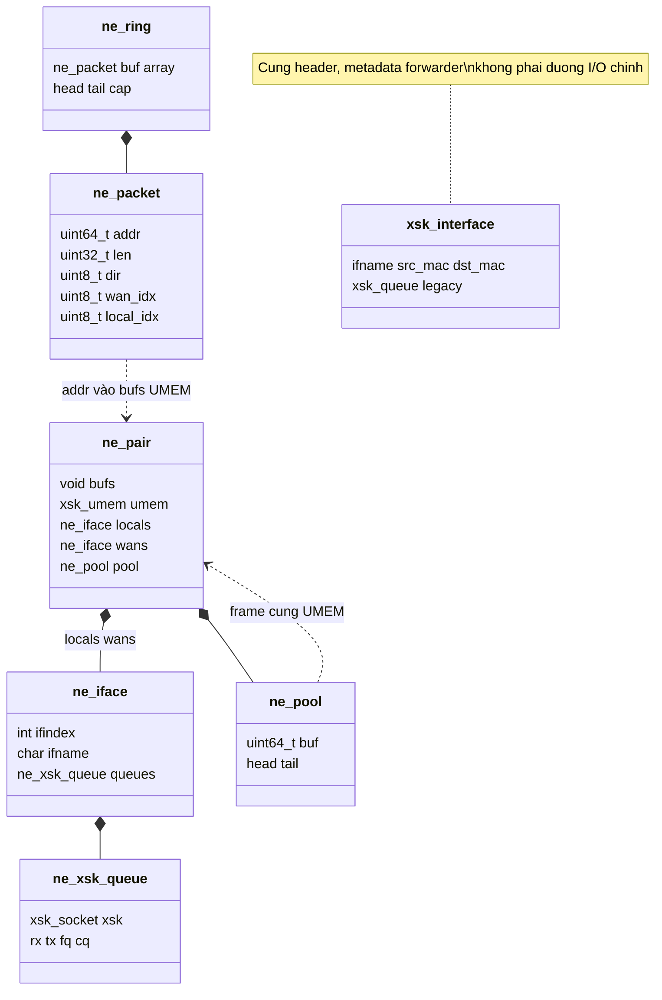
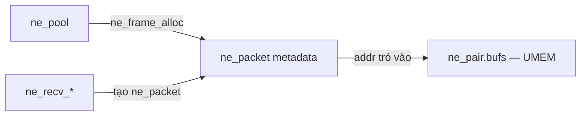
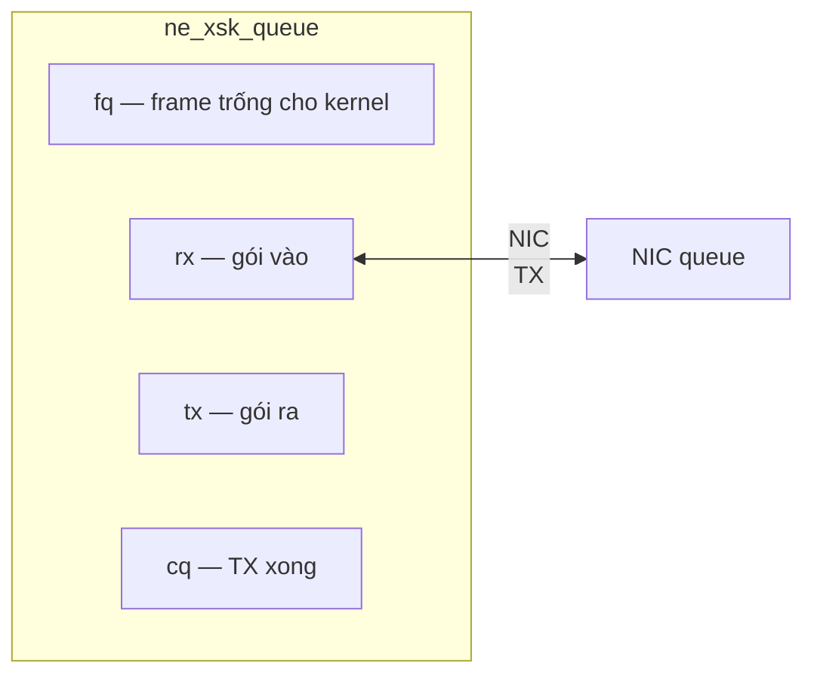
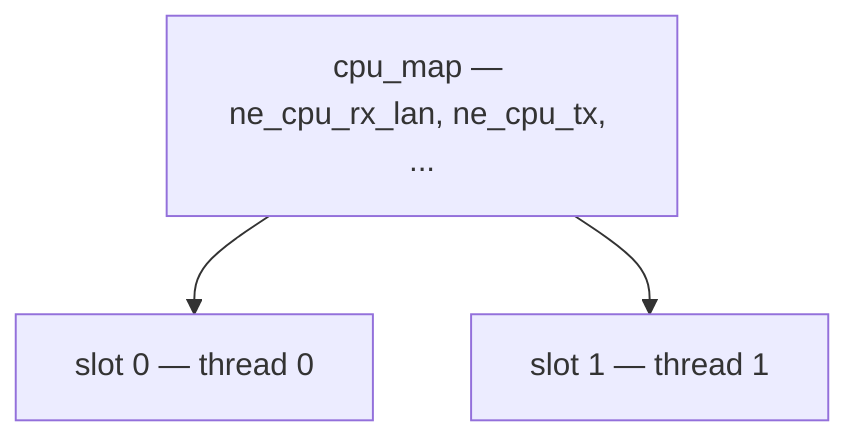

# interface — AF_XDP & bộ nhớ

> **Mục đích:** **không** thay `interface.h`. Doc này giải thích **UMEM + packet metadata + map queue** — thứ forwarder doc giả định bạn đã hiểu.  
> Field đầy đủ: [`inc/core/interface.h`](../inc/core/interface.h) · Luồng thread: [`forwarder.md`](forwarder.md)

<style>
.t{color:#4ec9b0}.p{color:#c586c0}.v{color:#e0e0e0}.m{color:#4fc1ff}.fn{color:#dcdcaa}
</style>

---

## 1. Phân cấp struct — interface.h



<span class="t">ne_pair</span> nằm trong <span class="t">forwarder</span>.<span class="v">pair</span> — sơ đồ ghép với forwarder: [`forwarder.md` §1](forwarder.md#1-sơ-đồ-quan-hệ-struct-toàn-bộ)

---

## 2. Gói tin không copy payload



| Thành phần | Vai trò |
|------------|---------|
| <span class="t">ne_packet</span>.<span class="v">addr</span> | Offset trong UMEM — payload nằm đây |
| <span class="t">ne_packet</span>.<span class="v">len</span>, <span class="v">dir</span>, <span class="v">wan_idx</span> | Metadata đi theo ring giữa các core |
| <span class="fn">ne_packet_data</span>(p, addr) | Đổi addr → con trỏ byte thật |

RX/TX chỉ truyền <span class="t">ne_packet</span> qua <span class="t">ne_ring</span> — không memcpy toàn bộ frame.

---

## 3. Một hardware queue AF_XDP



| Ring | Hướng |
|------|--------|
| <span class="v">fq</span> | App → kernel: “đây là frame trống, hãy nhận gói vào” |
| <span class="v">rx</span> | Kernel → app: gói vừa nhận |
| <span class="v">tx</span> | App → kernel: gói cần gửi |
| <span class="v">cq</span> | Kernel → app: frame TX xong, trả về pool |

---

## 4. RX/TX slot ↔ hardware queue

Mỗi thread RX/TX chỉ xử lý **một phần** queue của card:

```
queue q thuộc rx_slot s  khi  q % NE_RX_LAN_SLOTS == s
queue q thuộc tx_slot t  khi  q % NE_TX_SLOTS == t
```



Scale thêm RX/TX core → tăng slot → NIC cần đủ hardware queue (`NE_LOCAL_QUEUE_TARGET`, `NE_WAN_QUEUE_TARGET`).

---

## 5. ne_ring vs ne_pair


- <span class="t">ne_pair</span>: nói chuyện với **driver** (recv/tx NIC)  
- <span class="t">ne_ring</span>: nói chuyện giữa **thread** (metadata chờ xử lý)

Khai báo <span class="t">ne_ring</span> trong `interface.h`, **sở hữu** bởi <span class="t">forwarder</span>.

---

## 6. ne_pair vs xsk_interface

| | <span class="t">ne_pair</span> | <span class="t">xsk_interface</span> |
|--|--|--|
| Dùng để | I/O thật | Metadata config trong forwarder |
| Ai gọi | RX/TX thread, dataplane | `forwarder_init` copy tên/MAC |

I/O luôn qua <span class="v">fwd->pair</span>, không qua <span class="v">fwd->wans[]</span> trực tiếp.

---

## 7. API theo thread (forwarder gọi)

| Thread | Nhận / gửi |
|--------|------------|
| RX LAN | <span class="fn">ne_recv_local_slot</span>, <span class="fn">ne_refill_fq_local_slot</span> |
| RX WAN | <span class="fn">ne_recv_wan_slot</span>, <span class="fn">ne_refill_fq_wan_slot</span> |
| TX | <span class="fn">ne_drain_cq_all</span>, <span class="fn">ne_tx_drain_*_all</span> |

Màu: <span class="t">kiểu</span> · <span class="v">field</span> · <span class="fn">hàm</span>
