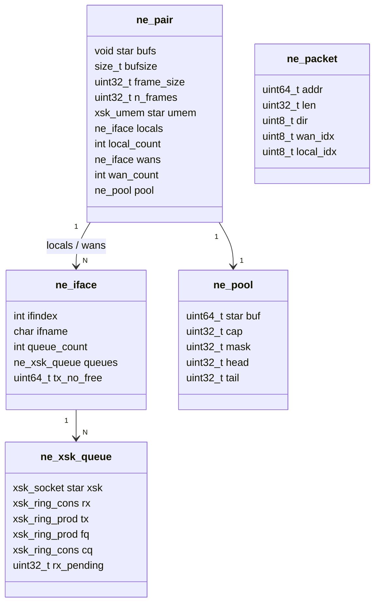
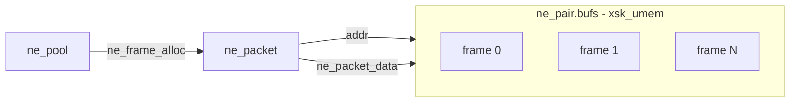
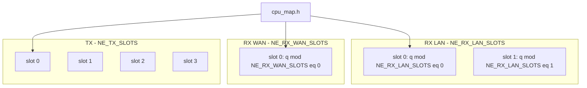
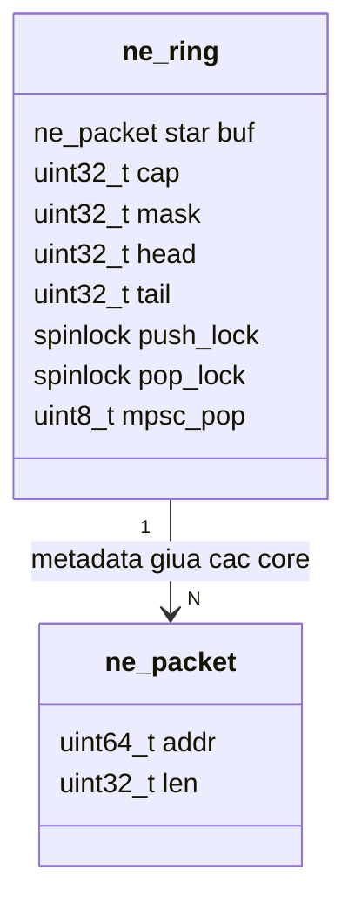

# `interface.h` — lớp AF_XDP & bộ nhớ gói tin

> **Đọc file:** mở preview Markdown (`Ctrl+Shift+V`) — cần extension [Markdown Preview Mermaid Support](https://marketplace.visualstudio.com/items?itemName=bierner.markdown-mermaid) (hoặc Mermaid built-in VS Code 1.121+).  
> File nguồn: [`inc/core/interface.h`](../inc/core/interface.h) · [`src/core/interface.c`](../src/core/interface.c)  
> Liên quan: [`forwarder.md`](forwarder.md)

Tài liệu mô tả **cấu trúc dữ liệu phía driver AF_XDP**: một vùng UMEM chung, metadata gói tin (`ne_packet`), và cách map queue NIC theo **RX/TX slot** từ [`cpu_map.h`](../inc/core/cpu_map.h).

---

## Tổng quan một dòng

```
ne_pair (UMEM + pool frame)
  ├── ne_iface locals[] / wans[]     ← mỗi card mạng
  │     └── ne_xsk_queue queues[]    ← mỗi hardware queue (fq/cq/rx/tx)
  └── ne_pool                        ← cấp phát frame trống trong UMEM

ne_packet.addr  ──trỏ──►  byte trong ne_pair.bufs (không copy payload)
```

Luồng I/O thực tế chạy trên `ne_pair`. `struct xsk_interface` (cùng header) là **metadata cấu hình** trong `struct forwarder`, không phải đường RX/TX chính.

---

## 1. Phân cấp struct (sở hữu)



| Struct | Vai trò |
|--------|---------|
| `ne_pair` | Gốc runtime: mở UMEM, gắn XDP, quản lý toàn bộ local/WAN |
| `ne_iface` | Một interface (tên, ifindex, danh sách hardware queue) |
| `ne_xsk_queue` | Một queue AF_XDP: socket + 4 ring kernel (`fq` / `cq` / `rx` / `tx`) |
| `ne_pool` | Stack frame trống trong UMEM (`ne_frame_alloc` / `ne_frame_free`) |
| `ne_packet` | **Chỉ metadata** — `addr` là offset UMEM, payload không copy |

---

## 2. Bộ nhớ: UMEM và `ne_packet`



- RX: kernel đổ frame vào UMEM → `ne_recv_*` trả `ne_packet` với `addr` đã có sẵn.
- TX: thread lấy `ne_packet` từ `ne_ring` (xem forwarder), ghi qua `ne_tx_drain_*`, frame trả về pool qua CQ drain.

Hằng số quan trọng (`interface.h`):

| Macro | Giá trị | Ý nghĩa |
|-------|---------|---------|
| `NE_FRAME` | 2048 | Kích thước frame UMEM |
| `NE_N_FRAMES` | 131072 | Số frame trong pool |
| `NE_BATCH_SIZE` | 64 | Batch recv mỗi vòng lặp RX |
| `NE_RING` | 16384 | Dung lượng ring mềm (khai báo ở forwarder) |

---

## 3. Hardware queue và CPU slot

Mỗi **RX slot** / **TX slot** chỉ xử lý **một phần** hardware queue của card, theo công thức `q % slot_count` (hàm `xsk_queue_for_slot` trong `interface.c`).



**Ràng buộc scale** (`cpu_map.h`):

- `NE_CLUSTER_RX_LAN` không lớn hơn `NE_LOCAL_QUEUE_TARGET` (mặc định 4)
- `NE_CLUSTER_RX_WAN` không lớn hơn `NE_WAN_QUEUE_TARGET` (mặc định 4)
- Mỗi core chỉ xuất hiện một lần (`ne_cpu_map_validate`)

---

## 4. API theo vai trò thread

| Thread (forwarder) | Gọi từ `interface.h` |
|--------------------|----------------------|
| RX LAN slot `s` | `ne_refill_fq_local_slot`, `ne_recv_local_slot`, `ne_recv_release_local_slot` |
| RX WAN slot `s` | `ne_refill_fq_wan_slot`, `ne_recv_wan_slot`, `ne_recv_release_wan_slot` |
| TX slot `t` | `ne_drain_cq_all`, `ne_tx_drain_local_all`, `ne_tx_drain_wan_all` |

Slot `s` / `t` trùng index với mảng thread trong forwarder và CPU trong `ne_cpu_*`.

---

## 5. `ne_ring` — không thuộc `ne_pair`

`struct ne_ring` được **khai báo** trong `interface.h` nhưng **sở hữu bởi** `struct forwarder` (xem [`forwarder.md`](forwarder.md)).



`ne_packet` trong ring vẫn trỏ cùng vùng UMEM của `ne_pair`.

---

## 6. `xsk_interface` vs `ne_pair`

Cả hai nằm trong `interface.h`, dùng cho hai mục đích khác nhau:

| | `ne_pair` + `ne_iface` | `xsk_interface` |
|--|------------------------|-----------------|
| Mục đích | Runtime AF_XDP (recv/tx thật) | Metadata card trong `forwarder` (tên, MAC, ifindex) |
| UMEM | Một UMEM chung cho cả pair | Struct riêng (legacy / tooling) |
| Ai dùng | `local_rx_thread`, `tx_thread`, dataplane | `forwarder_init` copy config WAN |

**Không xóa** `xsk_interface` khi đọc kiến trúc — forwarder vẫn giữ `fwd->wans[]` cho cấu hình; I/O đi qua `fwd->pair`.

---

## 7. `ne_packet.dir`

```c
enum ne_packet_dir {
    NE_DIR_LOCAL = 0,  /* gói từ LAN */
    NE_DIR_WAN  = 1,   /* gói từ WAN */
};
```

`wan_idx` / `local_idx` = chỉ số **dataplane slot** trong `ne_pair.wans[]` / `locals[]`, không phải index file config.
